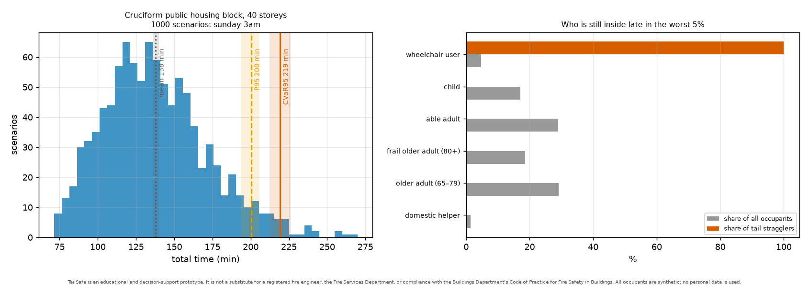

# TailSafe

[](https://github.com/chingkheinganba231005/Tail_Safe/actions/workflows/ci.yml)

Evacuation stress-testing for Hong Kong high-rise buildings. TailSafe simulates
thousands of possible fire nights in a residential tower and shows how bad the
worst ones are, why they are bad, and which low-cost operational changes make
them better.

**[Open the browser version](https://chingkheinganba231005.github.io/Tail_Safe/)** ·
[User guide (PDF)](docs/TailSafe-User-Guide.pdf) ·
[How it works](docs/architecture.md) ·
[Validation](docs/validation.md)


> **Not a fire-safety assessment.** TailSafe is an educational and
> decision-support prototype. It does not replace a registered fire engineer,
> the Fire Services Department, or compliance with the Buildings Department's
> *Code of Practice for Fire Safety in Buildings*. Every resident it simulates
> is synthetic, and many of its parameters are still assumptions (see
> [Limitations](#limitations)).

## Why

Evacuation plans are usually checked against a single design scenario with
average, able-bodied occupants. Real fires rarely look like that. At 3 a.m.
most residents are asleep and slow to react, a staircase can fill with smoke,
a lift can be out of service, and a wheelchair user may live on the 38th
floor. In a 40-storey block those nights decide the outcome, and an average
hides them.

TailSafe treats evacuation time as a distribution instead of a single number.
For each simulated night it samples who is at home and how quickly they move,
where the fire starts, which staircase is lost and when, and which lifts work.
It then reports two measures of the bad end of the distribution, the *tail*:

- **CVaR₉₅**: the average evacuation time over the worst 5% of nights, a
  measure borrowed from financial risk management;
- **P(RSET > ASET)**: the share of nights on which someone is still on a
  floor after it has become untenable, that is, when the time people need to
  get out (RSET) is longer than the time the building gives them before smoke
  makes it unsafe (ASET).

Changes to the building's operation are ranked by how much they shorten the
tail, not the average.

## What it does

- **Models the building.** Four procedurally generated Hong Kong building
  types (a cruciform public housing block, a slab block, a private tower with
  a scissor-stair core and a low-rise care home for the elderly), a floor plan
  read from an image, or a building file in JSON.
- **Fills it with people.** Synthetic households that depend on the time of
  day: older and frail residents, wheelchair users, children and live-in
  domestic helpers. A family moves at the pace of its slowest member, and some
  households go back for relatives before leaving.
- **Simulates the nights.** A queue-network simulator evacuates a 40-storey
  block in 0.1–0.3 s per night, so 1,000 nights take a little over a minute on four
  cores. A zone smoke model tracks visibility and toxic dose floor by floor.
- **Explains the tail.** Who is still inside on the worst nights, which floors
  fail, where the stairs queue, and which element would shorten the tail most
  if it were improved. The last question is answered by re-running the nights
  with that element changed.
- **Tests fixes.** Searches operational measures (evacuation lifts for
  residents who cannot use the stairs, holding stair doors open, stair
  assignment by floor, phased release and floor wardens) and confirms the
  best plan on nights it has not seen, trade-offs included.
- **Answers what-if questions instantly.** A graph neural network trained on
  the simulator estimates the result in a few tens of milliseconds while you
  move the controls; one click runs the full simulation to check it.
- **Writes the briefing.** A one-page summary for a building manager, with
  PDF export, in which every number is checked against the computed results.

## Two ways to use it

|  | Browser version | Full app |
|---|---|---|
| Where | [chingkheinganba231005.github.io/Tail_Safe](https://chingkheinganba231005.github.io/Tail_Safe/) | Runs on your computer (Docker, or Python and Node) |
| Devices | Any phone, tablet or computer with a modern browser | The computer running it, plus any device that can reach it over the network |
| Set-up | None | A one-off container build of several minutes, mostly downloads |
| Buildings | The four standard building types at their standard size | The four types at any size, a floor-plan image, or your own JSON building file |
| Scenarios | The reference scenario of each building | Any settings you choose |
| Results, 3D view, replay, bottlenecks, plan, briefing | Recorded in advance from the simulator (300 nights per building) | Computed when you ask (100 to 2,000 nights) |
| What-if | Yes, computed in your browser | Yes, plus *Confirm with full simulation* |
| Floor-plan reader | No | Yes |

Use the browser version to see what TailSafe does and to explore the four
standard buildings. Use the full app to study your own building or settings.

### Browser version

Open [chingkheinganba231005.github.io/Tail_Safe](https://chingkheinganba231005.github.io/Tail_Safe/)
on any device. Nothing is installed and nothing you enter is uploaded:
the site contains results recorded from the simulator for the reference
scenario of each building type, and the what-if network runs inside the
page. If you change a setting that has no recorded result, the page tells you
and offers to go back to the reference scenario.

The site is rebuilt from `main` by
[`.github/workflows/pages.yml`](.github/workflows/pages.yml).

### Full app

The full app runs the simulator, the API and the web interface together.

**With Docker** (the easiest way; install
[Docker Desktop](https://www.docker.com/products/docker-desktop/) on Windows
or macOS, or Docker Engine on Linux):

```bash
git clone https://github.com/chingkheinganba231005/Tail_Safe.git
cd Tail_Safe
docker build -t tailsafe .
docker run -p 7860:7860 tailsafe
```

Then open <http://localhost:7860>. To use it from a phone or tablet on the
same network, open `http://<your computer's IP address>:7860` there. Stop it
with `Ctrl+C`.

**From source** (Python 3.11 or newer, Node 20 or newer and `make`):

```bash
make install   # virtual environment in .venv: TailSafe, dev tools, JAX, PDF reader
make web       # build the web interface once
make api       # serve the API and the interface on http://localhost:8000
```

`make dev` runs the API together with a hot-reloading interface on
<http://localhost:5173>.

**At a public web address.** The same container runs as a free Docker
[Hugging Face Space](https://huggingface.co/docs/hub/spaces-sdks-docker).
[`.github/workflows/space.yml`](.github/workflows/space.yml) deploys it from
`main` once the Space is configured; the steps are in
[DEVELOPMENT.md](DEVELOPMENT.md#publishing). The free tier has two CPU cores
and runs one simulation at a time.

The first simulation after a start takes about ten seconds longer while the
simulator compiles.

## Example: a 40-storey block at 3 a.m.

The reference scenario is a Sunday at 3 a.m. in a 40-storey cruciform public
housing block with about 1,825 residents, 22% of them aged 65 or over. The
fire is on 14/F, Stair A is smoke-logged four minutes after the alarm, and one
lift is out of service. Over 1,000 simulated nights:



- On an average night everyone is out after 138 minutes, counting fire-service
  rescue of residents who cannot use the stairs. On the worst 5% of nights it
  takes 219 minutes on average (95% confidence interval 212–226 minutes).
- The last resident able to leave unaided is out after 86 minutes on average,
  and after 114 minutes on the worst 5% of nights.
- On 60% of nights someone is still on a floor after its corridors become
  untenable, most often on 14/F and 15/F: the fire floor and the one above.
- Losing Stair A drives the tail. Keeping it usable would cut the worst-5%
  average of the time for 95% of residents to get out by about 13 minutes.

`tailsafe optimize` then searches for an operational plan and confirms the
best one on 400 fresh nights. Here it proposes using the non-firefighting
lifts for residents with limited mobility, with floor wardens on 14/F and
35/F. The worst-5% average of the time until everyone is out falls from 205
to 105 minutes, because wheelchair users no longer wait for fire-service
rescue. The time for 95% of residents to get out gets about 9 minutes
*worse*, because frail residents who would otherwise walk now wait for the
lifts. When the lift out of service is one of the evacuation lifts, the one
that remains cannot keep up. TailSafe reports this trade-off instead of hiding
it.


These figures rest on parameters that are still largely assumptions, such as
the walking speed of frail residents, reaction times at night and fire-service
rescue logistics. Read them as an illustration of the method, not as a finding
about real buildings.

## The web interface

Nine screens in three groups, *Set up*, *Understand the worst nights* and
*Make it safer*, each with Back and Continue buttons. The layout works on
phones, and there are light and dark themes.

| Step | Screen | What it answers |
|---:|---|---|
| 1 | Building | Which building? Pick a type and its size, read a floor plan or upload a file, and check stair and exit widths. |
| 2 | Scenario | Which night? Time of day, age mix, fire floor, smoke, lost staircases, lifts and rescue teams. |
| 3 | Results | How bad is the tail? The distribution, CVaR₉₅, P(RSET > ASET), who is still inside, which floors fail. |
| 4 | 3D stack | How does a bad night unfold? Smoke and stair queues floor by floor over time. |
| 5 | Replay | What does it look like on one floor? Every person as a dot, compared with the fast simulator. |
| 6 | Bottlenecks | What causes it? Elements ranked by how much improving them cuts CVaR₉₅. |
| 7 | Optimise | What fixes it? A plan confirmed on fresh nights, before and after, with a side-by-side replay. |
| 8 | What-if | What if something changes? Instant estimates, and a full simulation on request. |
| 9 | Briefing | What should the building manager read? One page, with PDF export. |


The last step writes a one-page briefing for the building manager, exported as
PDF, in which every number is checked against the computed results:


With no building model at hand, the floor-plan reader (full app only) turns
an image of a typical floor into a building: draw a line of known length, let
TailSafe find rooms, doorways and stairs, correct what it got wrong and choose
the number of storeys.


The [user guide](docs/TailSafe-User-Guide.pdf) walks through every screen.

## Command line

Everything in the web interface is also available from the `tailsafe`
command (in `.venv/bin` after `make install`):

```bash
tailsafe building generate cruciform --storeys 40 --out out/tower.json   # a building file
tailsafe sim run cruciform --slot weekend_night --share-65 0.22 \
    --block-stair A@240 --plot out/run.png          # one night, summary and plot
tailsafe stress run cruciform --runs 1000 --out out/stress   # the reference scenario, 1,000 nights
tailsafe stress bottlenecks out/stress              # what drives the tail
tailsafe optimize cruciform --out out/plan          # search and confirm a plan
tailsafe brief --stress out/stress --optimization out/plan --pdf out/brief.pdf   # the briefing
tailsafe micro run cruciform --index 3 --level 14 --plot out/floor.png   # one night, person by person
tailsafe vision detect plan.png --scale 0,0,200,0,10 --out det.json      # read a floor plan
tailsafe vision build det.json --storeys 30 --out out/plan_building.json
tailsafe validate                                   # analytical checks of the simulator
tailsafe params list --assumptions                  # parameters that still need a source
```

`tailsafe --help` lists every command.

## How it works

```
building ─► synthetic households ─► scenario sampler ─► simulator + smoke model ─► Monte Carlo
                                                                                        │
  briefing ◄── optimiser ◄── bottleneck attribution ◄── risk metrics ◄──────────────────┘
```

- **Building model.** A multi-floor graph of places (flats, corridors,
  lobbies, stair landings, refuge floors, exits) and the connections between
  them (doors, walkways, stair flights), each with its width, plus the plan
  geometry of every floor. Building files are checked against a JSON schema.
- **Simulator.** A link-queue model in the family of MATSim's queue
  simulation, adapted to pedestrians and compiled with Numba. Door and stair
  capacities follow the hydraulic model of the SFPE Handbook, walking speed on
  stairs falls with crowding and fatigue, and people entering a stair from a
  floor take turns with those already on it.
- **Smoke.** A multi-zone network with a stack effect in stairs and lift
  shafts. Visibility and walking speed in smoke follow Frantzich and Nilsson,
  and toxic and heat dose follow ISO 13571. It is an engineering
  approximation, not CFD; CFD results can be imported instead.
- **Monte Carlo.** Latin hypercube batches, common random numbers so that
  plans are compared on identical nights, bootstrap confidence intervals, and
  optional early stopping once the CVaR₉₅ interval is narrow enough.
- **Bottlenecks.** Queue recurrence on the worst nights, the maximum flow and
  minimum cut of the escape network, and counterfactual re-runs with one
  element improved at a time.
- **Optimiser.** Sample-average approximation on common random numbers,
  greedy combination of measures, CMA-ES for phasing delays, and a paired
  confirmation on fresh nights.
- **Person-by-person replay.** A collision-free speed model (after Tordeux,
  Chraibi and Seyfried, 2016) that walks every person across the plan; used
  for replays and to cross-check the fast simulator.
- **Floor-plan reader.** Classical image processing (thresholding,
  morphology, gap and stair-tread detection) followed by human correction.
- **Surrogate.** A message-passing graph neural network in JAX with a
  monotone quantile output, trained on 800 simulated buildings.
- **Briefing.** Fixed sentences filled from the results, or an optional
  language-model draft that is rejected if it contains any number that is not
  in the results.


*A generated 40-storey cruciform block (`make example`): the plan of 1/F with the
graph the simulator walks on, and the tower with its refuge floor at 20/F.*

Design details and decisions are in [docs/architecture.md](docs/architecture.md).

## Validation

The checks run in CI and are written up in [docs/validation.md](docs/validation.md).

- On idealised corridors and stairs the simulator matches hand calculations
  with the hydraulic model to within 0.6%, and does not depend on its time
  step.
- Blocking a stair never shortens an evacuation, wider doors and exits never
  lengthen it, and smoke never speeds it up (paired tests on identical
  nights).
- CVaR₉₅ estimates settle, and their confidence intervals narrow, as the
  number of nights grows.
- The person-by-person simulator agrees with the fast one on when the last
  walker leaves a 20-storey block to within a few seconds on average; for the
  bulk of residents it is 7–15% slower.
- On buildings like those it was trained on, the surrogate's P95 of the time
  until everyone is out is off by 9% on average. On a building type it has
  never seen, the error ranges from 9% (twin core) to 33% (care homes).
- The floor-plan reader finds 96–100% of the doorways on rendered test plans.
  These plans are synthetic, so real drawings will do worse.

## Limitations

- **Most parameters are assumptions.** Of the 169 values in
  [`config/params.yaml`](config/params.yaml), 146 are marked
  `ASSUMPTION — needs citation`, among them the walking speed of frail
  residents, reaction times at night and fire-service rescue logistics. The
  others name a source that still has to be checked against the edition used.
  `tailsafe params list --assumptions` lists them.
- **The buildings are generic.** The four building types are procedural, not
  surveys of real blocks.
- **The smoke model is simple.** One fire, well-mixed zones and fixed exchange
  flows; no wind, sprinklers or pressurisation.
- **Rescue dominates the time until everyone is out.** The fire-service rescue
  model is assumed and sets that outcome's tail, so read it alongside the time
  until the last self-evacuee is out.
- **No calibration against drills yet.** The validation shows that the
  simulator does what the hydraulic model says, not that the hydraulic model
  and the parameters are right for Hong Kong towers.
- **The surrogate learns the simulator, not reality**, and is weakest on
  buildings unlike its training set, care homes in particular.

Every simplification is listed in [docs/assumptions.md](docs/assumptions.md).

## Project layout

```
tailsafe/         Python package
  building/       escape-route graph, JSON schema, Hong Kong building types
  population/     synthetic households and occupant profiles
  sim/            fast (queue-network) and person-by-person simulators
  hazard/         zone smoke model, tenability, ASET
  scenarios/      scenario specification, sampler, Monte Carlo runner
  risk/           CVaR, bootstrap intervals, who carries the tail
  analysis/       bottleneck attribution, agreement of the two simulators
  optimize/       operational plans and the search over them
  surrogate/      graph neural network and its trained weights
  vision/         floor-plan reader
  report/         briefing and one-page PDF
  api/            FastAPI job API, and the recorder for the browser version
web/              React and TypeScript interface
config/           parameter registry (params.yaml)
schemas/          JSON schema for building files
tests/            pytest suite, including the validation checks
docs/             user guide, architecture, validation, assumptions, specification
```

## Documentation

- [User guide (PDF)](docs/TailSafe-User-Guide.pdf): background, the ideas
  behind TailSafe in plain language, and every screen step by step
- [Architecture](docs/architecture.md): modules, data flow and design decisions
- [Validation](docs/validation.md): what has been checked, and how well it holds
- [Assumptions](docs/assumptions.md): every simplification, stated plainly
- [Specification](docs/spec.md): what TailSafe is meant to do
- [Development guide](DEVELOPMENT.md): commands, conventions, publishing

## Contributing

`make check` runs what CI runs: ruff, the format check, `mypy --strict` and
the tests. `make web-check` type-checks and tests the web interface. New
physical or demographic numbers belong in `config/params.yaml` with a source,
or with `ASSUMPTION — needs citation` when there is none yet. See
[DEVELOPMENT.md](DEVELOPMENT.md) for conventions.
