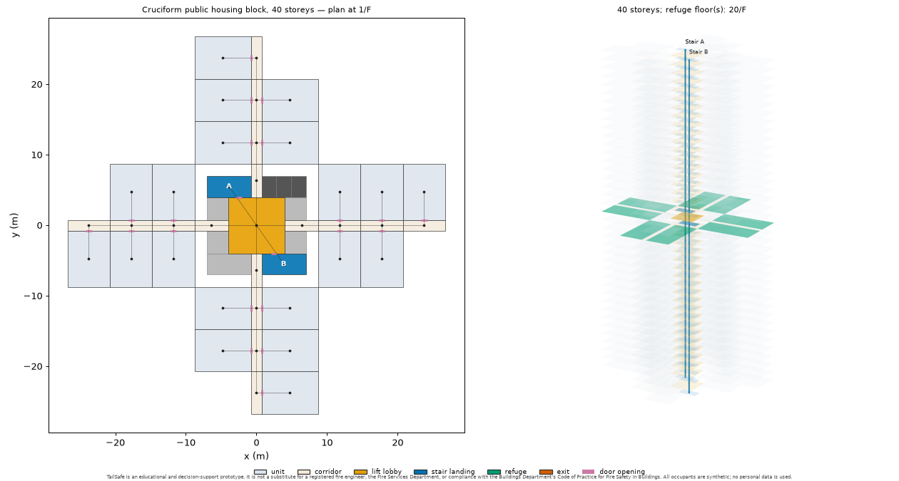
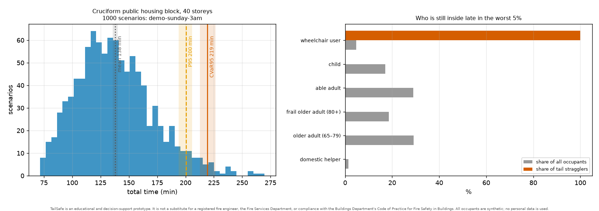
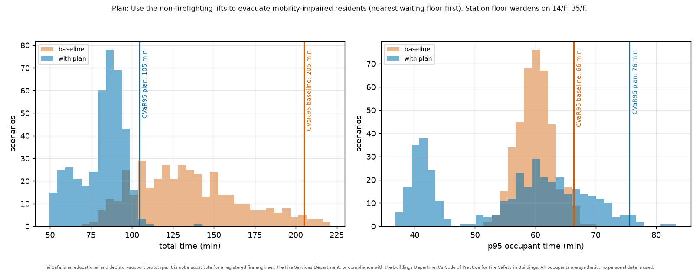
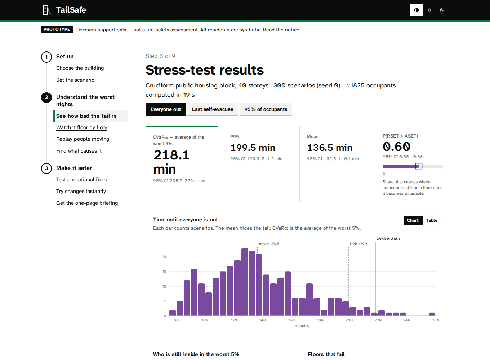
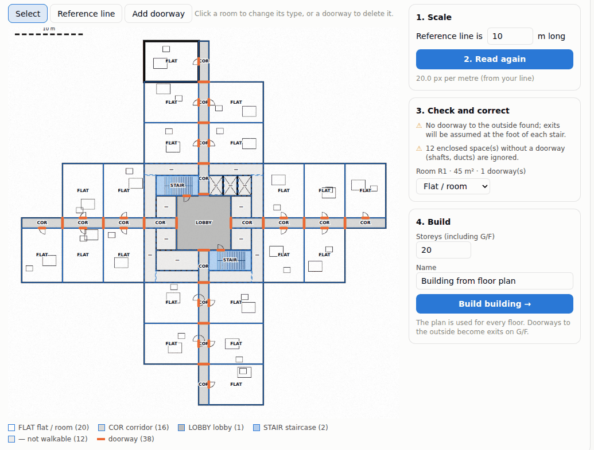
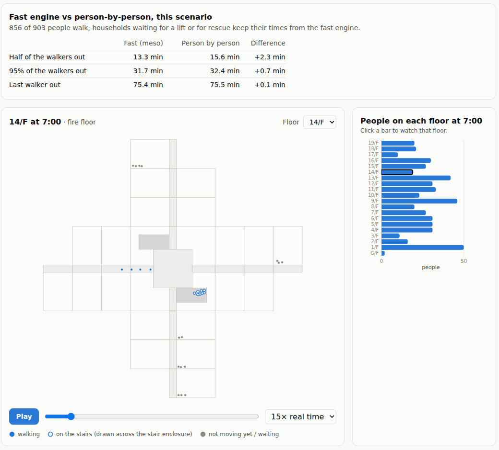
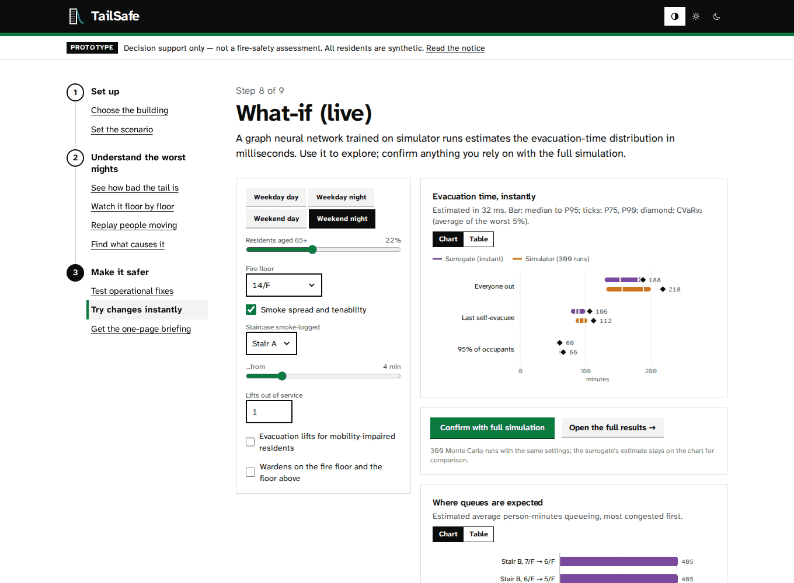
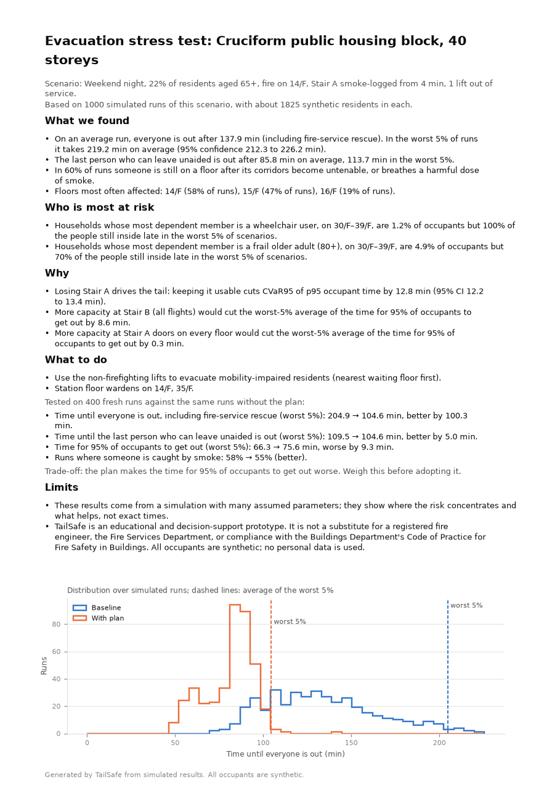

# TailSafe

**Tail-risk evacuation stress-testing for high-rise Hong Kong.**

TailSafe asks one question about a building: *what does the bad 5% of evacuation
outcomes look like, why, and which cheap operational changes fix it?* It samples
thousands of realistic, uncertain scenarios for a building (who is home at 3 a.m.,
where the fire starts, which stair is smoke-logged, which lift is out of service),
simulates each one with a fast mesoscopic crowd-flow engine, and reports tail-risk
measures such as **CVaR₉₅** (the expected evacuation time in the worst 5% of
scenarios) instead of a single "design" average.

> **Responsible use.** TailSafe is an educational and decision-support prototype.
> It is **not** a substitute for a registered fire engineer, the Fire Services
> Department, or compliance with the Buildings Department's *Code of Practice for
> Fire Safety in Buildings*. All occupants are synthetic; no personal data is used.
> Many parameters are still marked `ASSUMPTION — needs citation` in
> [`config/params.yaml`](config/params.yaml); see [`docs/assumptions.md`](docs/assumptions.md).

## Quick start

Requires Python 3.11+ and `make`.

```bash
make install     # create .venv and install tailsafe + dev tools (+ JAX for the surrogate)
make test        # fast test suite
make check       # lint + format check + mypy + tests (what CI runs)
make dev         # API on :8000 + web UI with hot reload on http://localhost:5173 (needs Node 20+)
make web         # or: build the UI once; `make api` then serves it on http://localhost:8000
make demo        # generate and render a 40-storey cruciform public-housing block
make stress-demo # 1,000-scenario stress test of the pitch scenario (~1 min on 4 cores)
```

The `tailsafe` command is installed into `.venv/bin`:

```bash
.venv/bin/tailsafe --help
.venv/bin/tailsafe params check              # validate the parameter registry
.venv/bin/tailsafe params list --assumptions # values that still need a citation
.venv/bin/tailsafe validate                  # analytical checks of the simulator
.venv/bin/tailsafe sim run cruciform --slot weekend_night --share-65 0.22 \
    --block-stair A@240 --plot out/run.png   # one scenario: JSON summary + plot
.venv/bin/tailsafe stress run cruciform --spec demo --runs 1000 --out out/demo
.venv/bin/tailsafe stress bottlenecks out/demo   # what drives the tail?
.venv/bin/tailsafe optimize cruciform --spec demo --out out/opt-demo  # which plan fixes it?
.venv/bin/tailsafe pitch --stress out/demo --optimization out/opt-demo
.venv/bin/tailsafe micro run cruciform --index 3 --plot out/floor.png --level 14  # one scenario, person by person
.venv/bin/tailsafe micro compare cruciform --runs 20   # how far the two engines agree
.venv/bin/tailsafe vision detect plan.png --scale 0,0,200,0,10 --out det.json --overlay out/det.png
.venv/bin/tailsafe vision build det.json --storeys 30 --out out/plan_building.json
.venv/bin/tailsafe surrogate data --cases 800 && .venv/bin/tailsafe surrogate eval  # retrain / re-evaluate the surrogate
.venv/bin/tailsafe brief --stress out/demo --optimization out/opt-demo  # briefing (Markdown + PDF)
```



*A procedurally generated 40-storey cruciform public-housing block (`make demo`):
typical-floor plan with the egress graph, and the 3D stack with the refuge floor.*

### Example: the pitch scenario

*Sunday 3 a.m., 40-storey public housing block, 22% of residents aged 65+,
Stair A smoke-logged at 4 minutes, one lift out of service* — 1,000 sampled
scenarios (`make stress-demo`):



> These numbers come from parameters that are still largely **assumptions**
> (walking speeds of frail residents, pre-movement at night, fire-service
> rescue logistics). Treat them as a demonstration of the method until the
> registry is calibrated.

### Example: the fix, and its trade-off

`tailsafe optimize` searches cheap operational plans with common random numbers
and confirms the best one on 400 fresh scenarios. For the pitch scenario it
proposes evacuation lifts for mobility-impaired residents plus two floor
wardens. The tail of the total evacuation time roughly halves, because
wheelchair users no longer wait for fire-service rescue, and P(RSET > ASET)
falls slightly. But the tail of the time for 95% of occupants to get out gets
*worse*: frail residents who would otherwise walk wait for the lifts. When the
lift out of service is an evacuation lift, the one that remains cannot keep up
and that group gets out later than on foot; when it is the firefighting lift,
both evacuation lifts run and almost everyone gains (the left-hand cluster in
the right panel). The numbers are in
[`docs/pitch_metrics.md`](docs/pitch_metrics.md), generated from the saved results.



### The web UI

`make dev` and open http://localhost:5173: pick a building, describe the
scenario, run the stress test, then follow the tail through the 3D stack view,
the bottleneck ranking and the optimiser's before/after comparison.



No building model? On the Building screen, *Floor plan image* reads a plan
(PNG, JPEG or PDF): draw a reference line, let TailSafe find rooms, doorways
and stairs, correct what it got wrong, and stack the floor into a tower:



The *Replay (people)* screen re-runs one scenario person by person with the
microscopic engine and compares it with the fast engine:



The *What-if (live)* screen answers as you move the controls: a graph neural
network trained on simulator runs estimates the median-to-P95 range and CVaR₉₅
of each outcome in milliseconds, and *Confirm with full simulation* runs the
real stress test and plots it alongside. Its accuracy, including on building
types it was not trained on, is in [validation](docs/validation.md#10-graph-surrogate-m10).



Finally, *Briefing* writes one page for the building manager from the numbers
computed above — and only those: every number in the text is checked against
the results (an optional LLM drafts the text when configured; a draft with
any other number is rejected), with a PDF export.



### The whole pitch in one command

```bash
.venv/bin/tailsafe demo --out out/pitch   # ~4 min on 4 cores: tail → causes → plan → replay → briefing
```

See [docs/demo.md](docs/demo.md) for the five-minute talk track.

## What is in the box

| Area | Module | Status |
|---|---|---|
| Parameter registry with sources | `config/params.yaml`, `tailsafe/config.py` | ✅ |
| Building model, JSON schema, HK typologies | `tailsafe/building/` | ✅ |
| Synthetic population and behaviour | `tailsafe/population/` | ✅ |
| Mesoscopic queue-network simulator (validated against hydraulic calculations) | `tailsafe/sim/` | ✅ |
| Scenario sampler, parallel Monte Carlo, CVaR₉₅ with CIs, tail breakdowns | `tailsafe/scenarios/`, `tailsafe/risk/` | ✅ |
| Zone smoke model: visibility, FED, ASET, P(RSET > ASET) | `tailsafe/hazard/`, `tailsafe/risk/tenability.py` | ✅ |
| Bottleneck attribution: recurrence, min-cut, counterfactual ΔCVaR₉₅ | `tailsafe/analysis/` | ✅ |
| Intervention optimiser (lifts, door hold-open, stair assignment, phasing, wardens) with paired confirmation | `tailsafe/optimize/` | ✅ |
| Background-job API (FastAPI, SSE progress, result cache) | `tailsafe/api/` | ✅ |
| Web UI: building setup, scenario builder, results, 3D stack, person-by-person replay, bottlenecks, optimise (before/after), live what-if | `web/` | ✅ |
| Microscopic replay engine (people as discs on the floor plan) with a meso–micro agreement study | `tailsafe/sim/micro.py`, `tailsafe/analysis/agreement.py` | ✅ |
| Floor-plan reader (walls, doorways, rooms, stairs, scale) with a correction editor | `tailsafe/vision/`, web Building screen | ✅ |
| Graph-neural-network surrogate (JAX) with leave-one-typology-out evaluation | `tailsafe/surrogate/` | ✅ |
| Grounded one-page briefing (template, or LLM with a number check) and PDF export; timed end-to-end demo | `tailsafe/report/`, web Briefing screen | ✅ |

## Status

Development follows the milestones in the [product specification](docs/spec.md) §9.
The current state of each milestone is tracked in [`DEVELOPMENT.md`](DEVELOPMENT.md).

## Repository layout

```
tailsafe/            Python package (building, population, sim, hazard, scenarios,
                     risk, analysis, optimize, surrogate, vision, report, api)
config/params.yaml   every physical / demographic parameter, each with a source
schemas/             JSON schemas generated from the Pydantic models
data/templates/      generated example buildings
docs/                architecture, validation, assumptions, pitch metrics
tests/               pytest suite
```

## Documentation

- [Architecture](docs/architecture.md) — modules, data flow and key design decisions
- [Validation](docs/validation.md) — analytical checks and what they show
- [Assumptions](docs/assumptions.md) — every simplification, stated plainly
- [Demo](docs/demo.md) — the five-minute pitch, step by step
